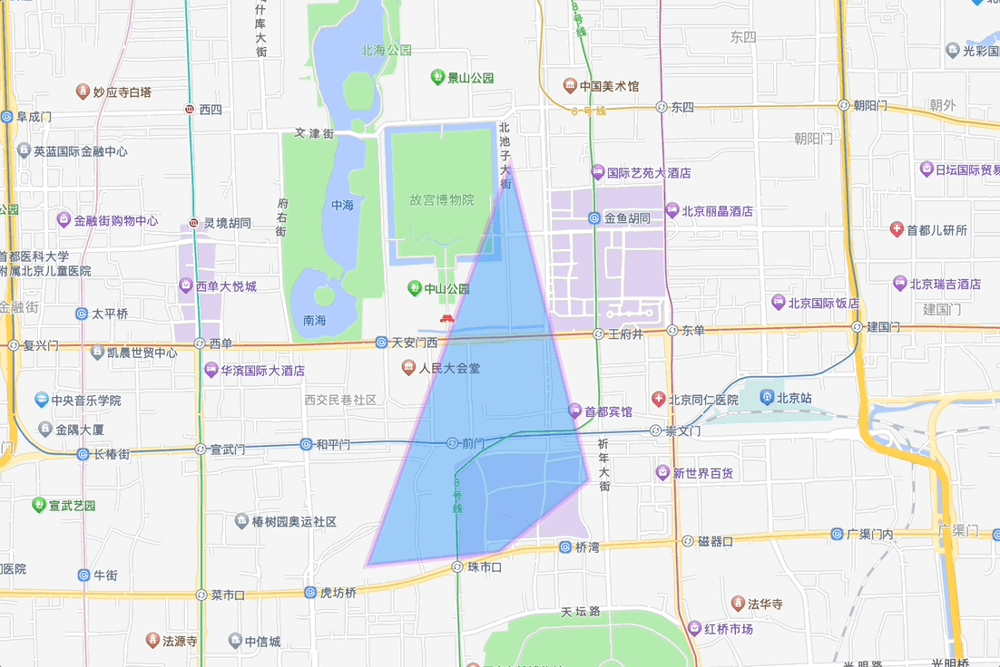

# 高德未支持工具封装

## 安装

```shell
npm install amap-toolkit
```

## 使用

```js
import AMapToolkit from "amap-toolkit";

const mapIns = new AMap.Map("container");

const polygonRangingIns = new AMapToolkit.PolygonRanging(mapIns);

// 或者直接使用部分功能
import { PolygonRanging } from "amap-toolkit";

const mapIns = new AMap.Map("container");

const polygonRangingIns = new PolygonRanging(mapIns);
```

## 本地运行

```shell
git clone https://github.com/MeetTheBest/amap-toolkit.git

cd amap-toolkit

npm install

npm run dev

# node 版本需要大于 v16.19.1
# 已安装 nvm 情况下，根目录下执行 nvm use 切换 node 版本
```

## 通用 API

| 参数      | 说明         | 类型                   |
| --------- | ------------ | ---------------------- |
| `start`   | 启用相应能力 | `instance.start(arg?)` |
| `stop`    | 停止相应能力 | `instance.stop()`      |
| `destroy` | 销毁相应能力 | `instance.destroy()`   |

## 多边形类工具

### 多边形测距 PolygonRanging

**示例**

```javascript
import { PolygonRanging } from "amap-toolkit";

const mapIns = new AMap.Map("container");

const polygonRangingIns = new PolygonRanging(mapIns);

const polygon = new AMap.Polygon({});

// 开启测距
polygonRangingIns.start(polygon);

// 适当时机销毁测距（如组件的 destroy 生命周期）
polygonRangingIns.destroy();
```



### 多边形绘制时测距 PolygonRangingInDrawing

**示例**

```javascript
import { PolygonRangingInDrawing } from "amap-toolkit";

const mapIns = new AMap.Map("container");

const polygonRangingIns = new PolygonRangingInDrawing(mapIns);

const mouseTool = new AMap.MouseTool({});

mouseTool.on("draw", () => {
    // 绘制完成后，需要停止
    polygonRangingIns.stop();
});

// 开始绘制多边形
mouseTool.polygon();

// 开启测距
polygonRangingIns.start();

// 适当时机销毁测距（如组件的 destroy 生命周期）
polygonRangingIns.destroy();
```


### 多边形编辑器测距 PolygonEditorRanging

**示例**

```javascript
import { PolygonEditorRanging } from "amap-toolkit";

const mapIns = new AMap.Map("container");

const polygon = new AMap.Polygon({});

const editor = new AMap.PolygonEditor(mapIns, polygon);

const polygonEditorRangingIns = new PolygonEditorRanging(mapIns);

// 开启测距
polygonEditorRangingIns.start(editor);

// 适当时机停止测距
polygonEditorRangingIns.stop();

// 适当时机销毁测距（如组件的 destroy 生命周期）
polygonEditorRangingIns.destroy();
```


### PolygonEditorEvent 多边形编辑器操作点事件

为什么要做这个？因为高德的 `PolygonEditor` 的 `adjust` 事件，只支持在操作点位结束后响应，并且响应的内容是当前编辑的多边形。

**示例**

```javascript
import { PolygonEditorEvent } from "amap-toolkit";

const mapIns = new AMap.Map("container");

const polygon = new AMap.Polygon({});

const editor = new AMap.PolygonEditor(mapIns, polygon);
editor.open();

const polygonEditorEventIns = new PolygonEditorEvent(editor);

polygonEditorEventIns.on("mousedown", (target) => {
    console.log("当前鼠标按下点位", target);
});

polygonEditorEventIns.on("mousemove", (target) => {
    console.log("当前移动点位", target);
});

polygonEditorEventIns.on("mouseup", (target) => {
    console.log("当前鼠标松开点位", target);
});

// 适当时机销毁测距（如组件的 destroy 生命周期）
polygonEditorEventIns.clearAll();
```


**API**

| 参数     | 说明                                         | 类型                                                                                                |
| -------- | -------------------------------------------- | --------------------------------------------------------------------------------------------------- |
| on       | 监听指定事件                                 | `on(eventName: mousedown \| mousemove \| mouseup, callback: (target: AMap.CircleMarker) => void)`   |
| off      | 移除指定事件                                 | `off(eventName: mousedown \| mousemove \| mouseup, callback: (target: AMap.CircleMarker) => void)`  |
| once     | 监听指定事件行为，触发一次后自动移除         | `once(eventName: mousedown \| mousemove \| mouseup, callback: (target: AMap.CircleMarker) => void)` |
| clearAll | 移除指定事件监听，`eventName` 不传则移除全部 | `clearAll(eventName?: mousedown \| mousemove \| mouseup)`                                           |

### 类矩形

为什么要做这个？因为高德的 `Rectangle` 是通过`2`点（西南点和东北点）创建矩形，所以无法创建出非水平方向的矩形，且不支持渲染功能；

**示例**

```javascript
import { LikeRectangle } from "amap-toolkit";

const mapIns = new AMap.Map("container");

const likeRectangleOptions = {
    map: mapIns,
    center: [116.400274, 39.905812] as [number, number],
    width: 200,
    height: 50,
    draggable: true,
    cursor: "pointer",
    fillOpacity: 0.3,
    strokeOpacity: 0.8,
    rotatable: true,
    bubble: true, // 事件穿透
};

// 使用 ts 时，地图会校验没有 LikeRectangle 类型
polygon = new LikeRectangle(likeRectangleOptions)! as unknown as AMap.Polygon;

mapIns.add([polygon]);
```


**API**

| 参数   | 说明                             | 类型                               |
| ------ | -------------------------------- | ---------------------------------- |
| path   | 矩形的 4 个点经纬度              | `[LngLat, LngLat, LngLat, LngLat]` |
| center | 中心点（宽+高+中心点创建`必传`） | `LngLat`                           |
| width  | 宽度（使用中心点创建`必传`）     | `number`                           |
| height | 高度（使用中心点创建`必传`）     | `number`                           |

### 类矩形编辑

**示例**

```javascript
import { LikeRectangle, LikeRectangleEditor } from "amap-toolkit";

const mapIns = new AMap.Map("container");

const likeRectangleOptions = {
    map: mapIns,
    center: [116.400274, 39.905812] as [number, number],
    width: 200,
    height: 50,
    draggable: true,
    cursor: "pointer",
    fillOpacity: 0.3,
    strokeOpacity: 0.8,
    rotatable: true,
    bubble: true, // 事件穿透
};

// 使用 ts 时，地图会校验没有 LikeRectangle 类型
polygon = new LikeRectangle(likeRectangleOptions)! as unknown as AMap.Polygon;

mapIns.add([polygon]);

likeRectangleEditorIns = new LikeRectangleEditor(
    mapIns!,
    likeRectangleIns as LikeRectangle,
    options, // options 配置如下
);
likeRectangleEditorIns.open();
```


**options API**

| 参数     | 说明                        | 类型                                 |
| -------- | --------------------------- | ------------------------------------ |
| onChange | 编辑器变化事件              | `(type: string, data: any) => void;` |
| isMobile | 是否为移动端（默认`false`） | `boolean`                            |
